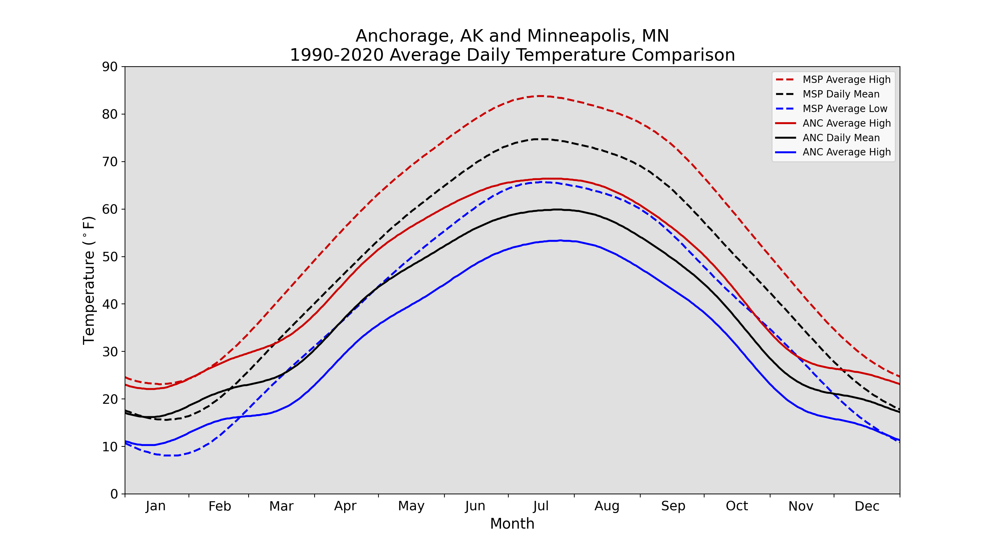
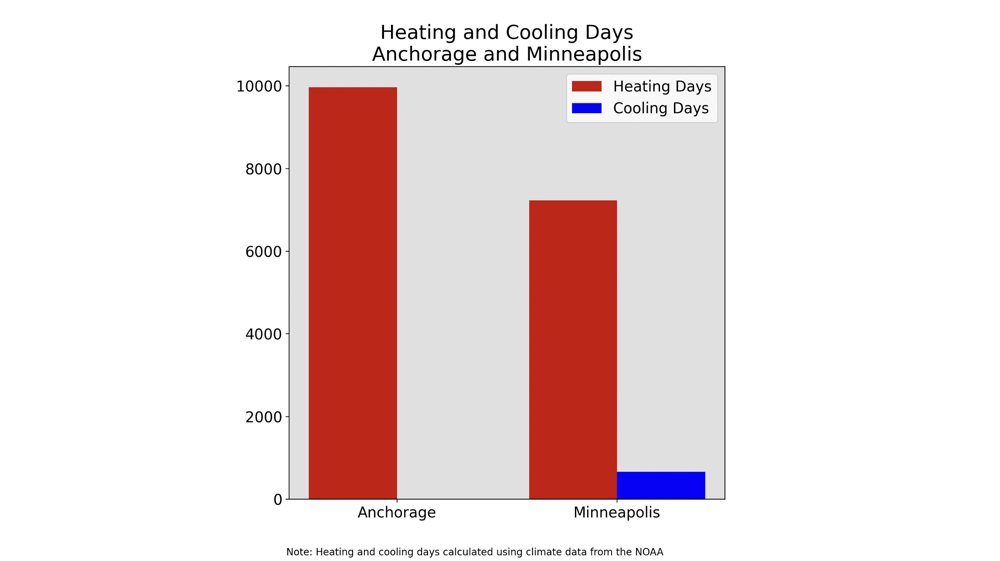
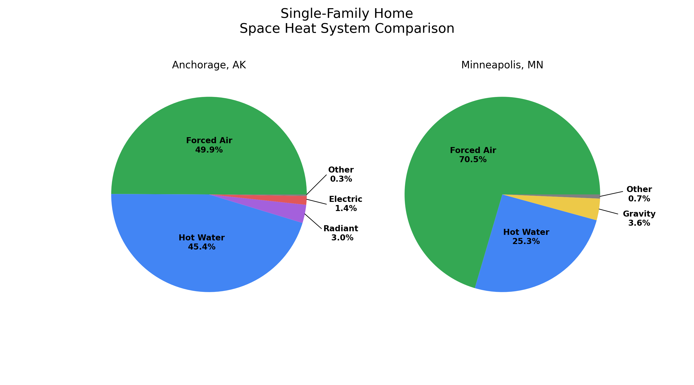

# Anchorage_Minneapolis_Heat_System_Comparison

# Overview

**Anchorage, AK**

Anchorage is a city of nearly 300,000 people located on the coast of southcentral Alaska with a subarctic climate. Homes in this city do not have air conditioners due to the mild summer temperatures, and typically rely on natural ventilation for the hottest summer days.
Heating homes is typically done nearly year-round, and most commonly burn natural gas, with some homes using oil or electricity as the energy source for heating. Anchorage residential heating systems can be divided into four different categories.

**Minneapolis, MN**

Minneapolis is the largest city in Minnesota with a population of 430,000 in the city proper and approximately 3.7 million in the urban area. Most of the heating systems in the city of Minneapolis are forced air systems, which can be used for cooling in the summer months. 

# Common Heating Systems

* **Radiant** - Characterized by radiant floor heating, which is expensive to install, but is a very efficient way of distributing heat.

* **Forced Air** - Uses ducts and vents to distribute hot air through the home. Can make occupants uncomfortable due to lack of moisture and can worsen allergies.

* **Hot Water** - Hot water baseboards are installed along the base of walls. They are slow to increase the room temperature and are known to not evenly heat large-sized rooms.

* **Electric** - Use baseboards to distribute heat, and have the same problems as hot water baseboards. Pros include quiet operation and low maintenance.

* **Gravity** - A gravity furnace takes advantage of gravity to transport heated air thoughout the home. Typically placed in the basement and air is vented through ductwork to rooms in the home. This is an older system which was commonly used in Minneapolis and the US in the 1930s.

Using public data from the Anchorage government, this project will evaluate the changes in the share of heating systems for new signle-family homes from 1960 to 2019.

# Method

Climate data was obtained from the NOAA to graph daily max, daily min, and daily mean temperatures from 1990 to 2020 and to calcaulte and graph heating and cooling day data for both Anchorage and Minneapolis.

The Municipality of Anchorage and the City of Minneapolis manages public data in a csv file for every single property in the city, including the type of heating system. Using python, the data was filtered based on the criteria of a single-family residential property. The share of each heating system type for every year was determined by summing the total number of each heating system and dividing it by the total number of new single-family homes for each year. 

# Results and Analysis

**Anchorage and Minneapolis Climate Comparison**

Temperatures in Minneapolis in the summer tend to be about 10°F higher in the summer months, 5°F degrees in the spring and fall, and similar temperatures in the winter. Even though summer temperatures in Anchorage and Minneapolis are only different by about 10°F, the key is that the daily mean temperatures from June to mid-September in Minneapolis are above the 65°F threshold whereas Anchorage the average daily mean temperatures from 1990-2020 are below the same threshold. The 65°F threshold is typically used to determine if the homes in a particular city need a cooling system. The 3.5 month period of hot summer temperatures in Minneapolis drives home-builders to install forced air systems, which can be used for both heating and cooling system. Anchorage home owners can generally get away with opening windows if summer temperatures get to high, and also do not warant the need to invest in a cooling system. This allows home builders to choose other heating system options, such as radiant floor boards.

**Anchorage and Minneapolis Heating and Cooling Day Comparison**

**Anchorage and Minneapolis Heating System Comparison**

**Anchorage Annual Heating System Market Share**

The figure above shows the annual share of heating systems installed in new single-family homes, as well as the number of new single-family homes per year. During the housing boom in the 1970s and 1980s, hot water baseboards were the overwhelming favorite by homebuilders, and are a coomon sight in older Anchorage homes. Electric baseboards were occasionally installed for a brief period in the 1970s as a result of the oil crisis, and have rarely been used since. The 1980s also saw a surge in forced air systems, and have maintained a a steady and significant share of the installed heating system share since the switch from hot water. Radiant floor heating has been shown some favor by homebuilders, taking in a share of 15% to 25% since 2005.

**Minneapolis Annual Heating System Market Share**

Forced air heating systems have consistently been installed in new Minneapolis homes due to its ability to be used for both heating and cooling. In the early 20th century, gravity systems were commonly installed in homes across the US, but after WWII, forced air systems become the dominant heating system in Minneapolis. Geothermal heat pump systems could be a possible alternative to forced air systems due to an imminent push to electricity any energy system in not just the residential sector, but in the commercial, transportation and industrial sectors. If properly installed and sized to the homes energy needs, geothermal heat pumps can provide 100% of space heating and cooling requirements.
